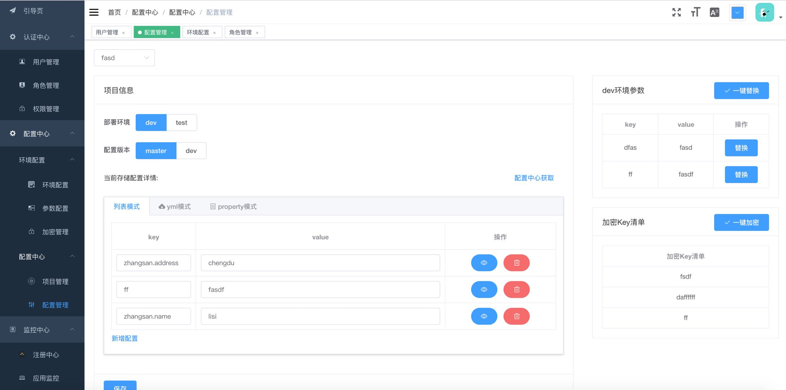

# examOnline
该项目是基于Spring cloud微服务架构来实现的在线考试系统，包括API网关、注册中心、配置中心、授权中心以及后端的服务。主要的业务功能可以参考另一个开源项目examstack。在该项目中同时也会使用到一些第三方的开源项目，如：Spring boot admin来处理应用的监控；scca来实现图形化的应用配置中心；等，

1. exam-eureka：通过eureka实现的服务注册中心
2. exam-config-server：基于数据库的配置中心
3. exam-config-admin：基于数据库的配置中心的rest服务
4. exam-user：用户中心
5. exam-auth：授权中心
6. exam-gateway：网关
7. exam-monitor：基于Spring boot admin的应用监控中心，实现服务下线通知

### 前端
前端通过vue-element-admin改造的后台，GitHub地址：[exam-admin](https://github.com/tlhhup/exam-admin)

1. 配置中心
	
	

2. spring boot admin监控

	
3. 注册中心

	

### 开发环境
1. jdk1.8+、maven、docker、docker-compose、mysql、idea

### 准备
1. docker
    1. redis容器

    		docker run --name redis-server -d -p 6379:6379 redis
    2. zipkin容器

    		docker run --name zipkin-server -d -p 9411:9411 openzipkin/zipkin

## CI/CD 处理

采用Jenkins、Rancher和docker私服搭建持续集成和持续发布。

### 环境准备
1. 安装虚拟机，采用4台虚拟机搭建环境，操作系统采用centos7mini，每台主机的角色如下：
	 1. Jenkins：192.168.10.101 
	 2. Registry：192.168.10.102 
	 3. Rancher：192.168.10.103 
	 4. Rancher node：192.168.10.104
	 5. 每台主机关闭防火墙 

			sudo systemctl disable firewalld
	 6. 配置/etc/hosts文件

	 		192.168.10.101 jenkins
	 		192.168.10.102 registry
	 		192.168.10.103 server
	 		192.168.10.104 node1
	 7. 设置主机名

	 		hostnamectl set-hostname jenkins/registry/server/node1
1. 安装Linux虚拟机docker环境
	1. 准备docker环境
		1. 移除旧的docker环境

				sudo yum remove docker \
                  docker-client \
                  docker-client-latest \
                  docker-common \
                  docker-latest \
                  docker-latest-logrotate \
                  docker-logrotate \
                  docker-engine
		2. 准备环境

				sudo yum install -y yum-utils \
					  device-mapper-persistent-data \
					  lvm2
				sudo yum-config-manager \
				    --add-repo \
				    https://download.docker.com/linux/centos/docker-ce.repo
		3. 安装docker-ce

				 sudo yum install docker-ce docker-ce-cli containerd.io
	2. 配置docker自启动

			sudo systemctl enable docker
			sudo systemctl start docker
2. 安装Jenkins
	1. 创建容器挂载目录，在宿主机中存储Jenkins的数据

			mkdir /var/jenkins_data/
	2. 安装Jenkins

			docker run --name jenkins   -u root  -d   -p 8081:8080   -p 50000:50000   -v /var/jenkins_data:/var/jenkins_home   -v /var/run/docker.sock:/var/run/docker.sock   jenkinsci/blueocean
	3. 浏览器打开Jenkins
		1. 采用安装推荐的插件
		2. 插件管理安装maven插件
		3. 全局工具配置，找到Maven，**设置名称为M3**,**勾选自动安装**
3. 安装Rancher
	1. 安装Rancher Server

			sudo docker run -d --restart=unless-stopped -p 8080:8080 rancher/server:stable
	2. 添加node主机
		1. 通过浏览器访问Rancher Server
		2. 选择添加主机，再node节点执行界面上的命令即可 
4. 安装docker私服
	1. 创建registry的配置文件，config.yml，将其放置在/data目录

			version: 0.1
				log:
				  fields:
				    service: registry
				storage:
				  delete:
				    enabled: true
				  cache:
				    blobdescriptor: inmemory
				  filesystem:
				    rootdirectory: /var/lib/registry
				http:
				  addr: :5000
				  headers:
				    X-Content-Type-Options: [nosniff]
				health:
				  storagedriver:
				    enabled: true
				    interval: 10s
				    threshold: 3
	2. 创建数据目录

			mkdir -p /opt/data/registry
	3. 创建容器

			docker run -d -p 5000:5000 --restart=always --name registry -v /opt/data/registry:/var/lib/registry  -v /data/config.yml:/etc/docker/registry/config.yml  registry:2

### Jenkins处理持续继承
1. 修改docker的配置文件，应用私服
	1. 编辑docker.service文件，添加如下内容

			vi /usr/lib/systemd/system/docker.service 
			ExecStart=/usr/bin/dockerd  --insecure-registry 192.168.10.102:5000 
2. 编写项目的pipeline
	1. 创建流水线项目
	2. 编写pipeline(以其中一个模块为列)

			node {
			   def mvnHome
			   stage('Preparation') {
			      git(
			        url:'https://github.com/tlhhup/examOnline.git',
			        branch:'dev'
			      )
			      mvnHome = tool 'M3'
			   }
			   stage('Build') {
			      sh "'${mvnHome}/bin/mvn' -f exam-auth/pom.xml -Dmaven.test.failure.ignore clean package install"
			   }
			   stage('Results') {
			      archiveArtifacts 'exam-auth/auth-server/target/*.jar'
			   }
			   stage('Build Image'){
			      sh "'rm' -rf deploy" 
			      sh "'mkdir' deploy"
			      sh "'cp' exam-auth/auth-server/target/*.jar deploy"
			      sh "'cp' exam-auth/auth-server/src/main/docker/Dockerfile deploy"
			      sh "'docker' build -t registry:5001/auth-server:v1 deploy"
			   }
			   stage("Deploy"){
			      sh "'docker' push registry:5001/auth-server:v1" 
			   }
			} 

### Rancher处理持续发布
1. 修改docker的配置文件，应用私服
	1. 编辑docker.service文件，添加如下内容

			vi /usr/lib/systemd/system/docker.service 
			ExecStart=/usr/bin/dockerd  --insecure-registry 192.168.10.102:5000 
2. 通过UI界面处理容器编排
	1. 拉去私服镜像

			# 要写IP，不能写主机名称
			192.168.10.102:5001/auth-server:v1
			 	